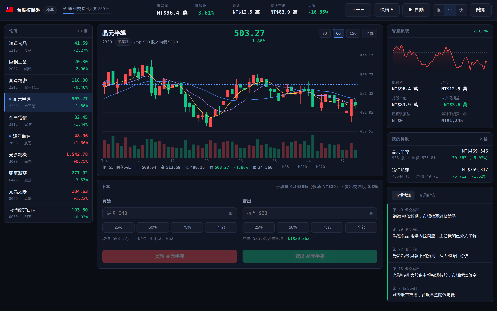

# 三市場模擬炒股

用假錢體驗真實心跳的模擬交易遊戲。三種市場、十檔標的、會跑新聞的隨機行情，
看你在一輪行情結束後是股神還是韭菜。



## 玩法

1. 選市場（台股／美股／加密貨幣）與難度（新手／標準／地獄）
2. 從左側報價點選標的，看 K 線與均線決定進出場
3. 在下單面板買進賣出，按「下一日」或開自動播放推進行情
4. 一輪跑完結算，看你有沒有打敗大盤

快捷鍵：`空白鍵` 推進一根 K 棒、`A` 切換自動播放。進度會自動存在瀏覽器
localStorage，關掉分頁再回來可以接著玩，最佳戰績也會留在首頁排行榜。

## 三種市場

| | 台股模擬盤 | 美股模擬盤 | 加密貨幣市場 |
|---|---|---|---|
| 起始資金 | NT$1,000,000 | $100,000 | $50,000 |
| 一局長度 | 250 個交易日 | 252 個交易日 | 360 根 4 小時 K（約 60 天）|
| 漲跌停 | ±10% | 無 | 無 |
| 手續費 | 0.1425%（低消 NT$20）| 0.05%（低消 $1）| 0.1% |
| 賣出稅 | 證交稅 0.3% | 無 | 無 |
| 配息 | 每 60 日除息入帳 | 每季配息 | 無 |
| 漲跌配色 | 紅漲綠跌 | 綠漲紅跌 | 綠漲紅跌 |
| 特色 | 波動溫和、有殖利率題材 | 財報行情兇猛 | 可買零碎單位、穩定幣可避風港 |

## 行情是怎麼跑出來的

價格用幾何布朗運動加上一個共同市場因子產生，每檔標的有自己的漂移率、
波動率與 beta，所以類股會一起動，但個股仍有自己的命運。

- **新聞事件**：隨機抽出個股／類股／大盤事件，帶來當根 K 棒的立即衝擊，
  外加一段時間的額外漂移。點新聞可以跳到對應標的。
- **極端行情**：一局最多各發生兩次股災與資金行情，難度越高股災機率越大。
- **除息**：持股會收到現金股利，同時股價除息下調，領到的股利會沖抵持股成本。
- **穩定幣**：向錨定價格均值回歸，市場崩盤時是唯一的避風港。
- **可重現**：亂數種子與狀態都存在存檔裡，同一顆種子每次都會跑出一樣的行情。

難度只調整三件事：波動倍率、漂移倍率、事件頻率。地獄難度的大盤中位數報酬
明顯低於新手，而且幾乎一定會遇上股災。

## 開發

```bash
npm install
npm run dev      # 開發伺服器 http://localhost:5173
npm run build    # 打包到 dist/
npm run preview  # 預覽打包結果
```

React 18 + Vite，沒有其他執行時相依套件；K 線圖與資產走勢圖都是自己用
Canvas 畫的。

```
src/
  engine/       純函式的遊戲核心，不依賴 React
    rng.js          可序列化的亂數產生器
    markets.js      三種市場與難度設定
    events.js       新聞事件池
    simulation.js   價格模擬、事件、除息、結算
    trading.js      下單、手續費與稅、損益計算
    persistence.js  localStorage 存檔與排行榜
    format.js       數字與時間格式化
  hooks/useGame.js  遊戲狀態、自動播放、自動存檔
  components/       介面元件
```

引擎是純函式，可以直接在 Node 裡跑整局來調參數：

```bash
node -e "import('./src/engine/simulation.js').then(m=>{
  let s = m.createGame({ marketId: 'tw', difficultyId: 'hard', seed: 42 })
  s = m.advanceMany(s, s.totalTicks)
  console.log('大盤指數', m.indexValue(s).toFixed(1))
})"
```

## 免責聲明

遊戲裡所有公司、代號、幣種都是虛構的，行情由亂數產生，與真實市場無關，
也不構成任何投資建議。
